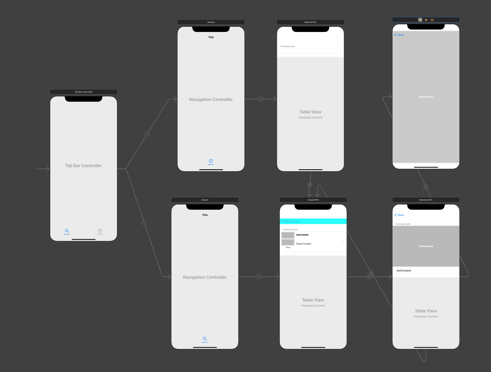

# Final Application

## Video Demonstration

https://youtube.com/shorts/-3LTnmhM_7Y?feature=share

## Storyboard

The application storyboard is laid out as below, with a tab bar controller navigating to two different table view controllers: `TweetsTVC` and `HistoryTVC`. `HistoryTVC` is table that displays recent searches saved in `UserDefaults`, which segues into `TweetsTVC` with the searched item. `TweetsTVC` in turn can segue in to another table view controller `MentionsTVC`, used to display tweet media and mentions in table form. Finally, `MentionsTVC` can segue to an ImageVC used to display tweet image media in fullscreen. Each segue has a recogniseable identifier, named after the controller it segues to.

## TweetsTVC & TweetsTVCell

The table view controller and cell are much the same as described in Part 1. The only alteration to the cell is that tweet mentions, urls and hashtags are shown in different colours. This is done by forming an `NSMutableAttributedString` with the tweet text, and the indices of every mention or media are used to add a foreground colour attribute specific to each type.

The view controller now has two new segue functions, `shouldPerformSegue` and `prepare`. The former of these functions determines whether a segue should occur if the segue identifier is correct, using an enum `StoryboardIdentifiers` to confirm, and the latter sends the tweet data for the cell chosen to the `MentionsTVC`.

Finally, persistence has been added. When the queryText is altered, it is added to the previously searched array if it exists and is less than 100, otherwise it removes the last element. If the array does not exist it creates the array and appends the first search as the only element.

## MentionsTVC & Accompanying Table Cells

MentionsTVC has a `tweet` variable used to hold the tweet data sent to it, and a `sections` array to describe what sections should be displayed. The `sections` array is made up of `Section` structs, which contain the section name and count of items it holds. When the view loads, the sections array is populated based off the tweet content, and the tableview datasource and delegates are set.

Table row and section counts are then set based off the `sections` array, and the size of the row is determined by the section element. Cells are then populated by the section name, using `ImageTVCell` and `MentionsTVCell` type table cells, which contain either a UILabel or UIImage depending on what they must display.

`shouldPerformSegue` and `prepare` functions are used in the same way as in `TweetsTVC`. The `StoryboardIdentifiers` enum ensures only valid identifiers allow segue to occur, and in the case of the section being `URL`, calls `UIApplication.shared.open(URL(string: cellText)!)` to open the URL (cellText) in the browser. The `prepare` function passes either tweet text or image content to the next View Controller (either an `ImageVC` to view the image in fullscreen, or the `TweetsTVC` using the cell text as search input).

## RecentsTVC

This table view controller looks for an array of previous searches in `UserDefaults` and populates the table (only one section) with a row for each query. The segues are controlled and prepared for in the same way as `MentionsTVC`. If a table row is selected, it will segue to the `TweetsTVC` with the cell text as the new query.

## ImageVC

The `ImageVC` uses a scrollView and conforms to the `UIScrollViewDelegate`. The outlet for the scrollView sets the delegate to the view controller in the didSet, and adds an empty imageView to its subviews. The viewForZooming function is inherited from the `UIScrollViewDelegate` and sets the empty imageView as the scrollable view. A nil UIImage variable `imageToDisplay` is also declared, and this is set during the segue from the previous view controller. When the view loads, this image is set to the empty imageView, and the scrollView is configured to zoom to fill the image to the view size.
